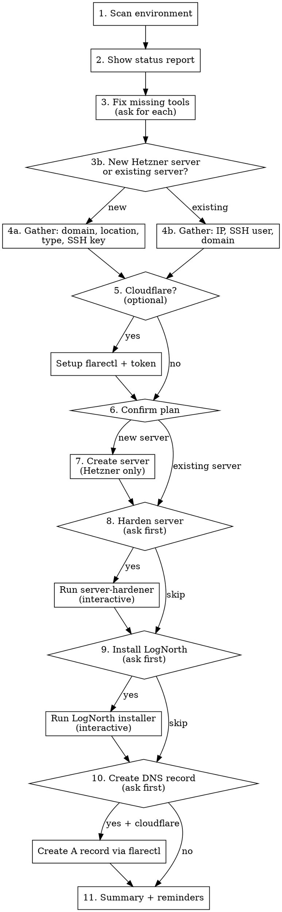

# Deploy LogNorth

Deploy LogNorth to a new Hetzner server or an existing server you already have. Optionally harden the server and configure Cloudflare DNS.

**Principle:** Scan first, report status, ask before every invasive action.

## Flow



## Phase 1: Preflight

### Step 1 — Scan Environment (silent, no questions)

Run all checks, collect results:

```bash
# hcloud CLI
which hcloud && hcloud version
hcloud context active 2>/dev/null

# flarectl
which flarectl

# Local SSH keys
ls ~/.ssh/*.pub 2>/dev/null

# Hetzner SSH keys (only if hcloud configured)
hcloud ssh-key list 2>/dev/null
```

### Step 2 — Present Status Report

Show everything at once so the user sees the full picture:

```
Environment check:
  hcloud CLI:       ✓ installed (v1.x.x) / ✗ not installed
  Hetzner token:    ✓ configured (context: xxx) / ✗ not configured
  flarectl:         ✓ installed / ✗ not installed
  Local SSH keys:   ✓ N keys found / ✗ none found
  Hetzner SSH keys: ✓ N keys / — (can't check without token)
```

### Step 3 — Fix Missing Tools (ask for each)

For each missing item, ask whether to install/configure. One at a time:

| Missing | Ask | Action if yes |
|---------|-----|---------------|
| hcloud CLI | "Should I install it?" | `brew install hcloud` |
| Hetzner API token | "Should I set it up? You'll need to create one in Hetzner Cloud Console → Project → Security → API Tokens (read/write)" | Ask user to paste token, run `hcloud context create lognorth --token <token>` |
| flarectl | Asked later (only if Cloudflare opted in) | `brew install cloudflare/cloudflare/flarectl` |
| No SSH keys at all | "You need an SSH key. Should I generate one?" | `ssh-keygen -t ed25519` |

**Note:** hcloud is only required for new server creation. If user has an existing server, hcloud is optional.

### Step 3b — Choose Mode

```
Do you want to:
  1. Create a new server on Hetzner
  2. Use an existing server (any provider)
```

This determines whether we need Hetzner CLI and which questions to ask next.

## Phase 2: Gather Choices

Ask one question at a time. Wait for answer before asking next.

### Path A: New Hetzner Server

**If user declined hcloud install in step 3:** explain it's required for this path and stop gracefully.

#### Domain

```
What domain will LogNorth run on? (e.g. logs.example.com)
```

#### Server Location

List locations from `hcloud location list` and let user pick:

```
Available locations:
  1. Falkenstein (fsn1) — Germany
  2. Nuremberg (nbg1) — Germany
  3. Helsinki (hel1) — Finland
  4. Ashburn (ash) — US East
  5. Hillsboro (hil) — US West
  6. Singapore (sin) — Asia

Which location?
```

#### Server Type

List affordable options from `hcloud server-type list` (filter to shared CPU, reasonable sizes):

```
Server types:
  1. CX22  — 2 vCPU,  4GB RAM,  40GB — €4.35/mo
  2. CX32  — 4 vCPU,  8GB RAM,  80GB — €7.69/mo
  3. CX42  — 8 vCPU, 16GB RAM, 160GB — €14.49/mo

LogNorth minimum: 1 vCPU, 512MB RAM, 10GB SSD
Which server type?
```

**Note:** Fetch actual types and prices from `hcloud server-type list` at runtime rather than hardcoding.

#### SSH Key

```bash
hcloud ssh-key list
```

If keys exist in Hetzner: let user pick from list.
If no Hetzner keys but local keys exist: offer to upload one.

```
No SSH keys in Hetzner. Local keys found:
  1. ~/.ssh/id_ed25519.pub
  2. ~/.ssh/id_rsa.pub

Upload one to Hetzner? Which one?
```

Upload with: `hcloud ssh-key create --name <name> --public-key-from-file <path>`

### Path B: Existing Server

Ask:
1. **Server IP:** "What's your server's IP address?"
2. **SSH user:** "What SSH user should I use? (e.g. root, ubuntu, admin)"
3. **SSH port:** "What SSH port? (default: 22)"
4. **Domain:** "What domain will LogNorth run on?"

Verify SSH connectivity:
```bash
ssh -o ConnectTimeout=5 -p <port> <user>@<ip> echo ok
```

If it fails, help troubleshoot (wrong key, port, user).

### Cloudflare (optional, both paths)

```
Do you use Cloudflare for DNS on this domain? (y/n)
```

If yes:

**1. Install flarectl** (if not already installed):
```bash
brew install cloudflare/cloudflare/flarectl
```

**2. Get a Cloudflare API token.** Walk the user through this:

```
You need a Cloudflare API token with DNS edit permissions.

  1. Go to https://dash.cloudflare.com/profile/api-tokens
  2. Click "Create Token"
  3. Use the "Edit zone DNS" template
  4. Under Zone Resources: select the zone for your domain
  5. Click "Continue to summary" → "Create Token"
  6. Copy the token (you won't see it again)
```

**3. Store and verify the token.** Ask the user to paste it, then:

```bash
# Export for this session
export CF_API_TOKEN="<token-user-provided>"

# Verify it works — this MUST succeed before proceeding
flarectl zone list
```

If `flarectl zone list` fails (401, no zones, etc.) — stop and troubleshoot. Do NOT continue to DNS setup with a broken token.

**4. Persist the token** (ask the user):

```
Your Cloudflare token works. Want me to add it to ~/.zshrc so it persists across sessions? (y/n)
```

If yes:
```bash
echo '' >> ~/.zshrc
echo '# Cloudflare API token (flarectl)' >> ~/.zshrc
echo 'export CF_API_TOKEN="<token-user-provided>"' >> ~/.zshrc
```

If no: remind them the token is only set for this session.

## Phase 3: Confirm & Create

### Confirmation

Show full plan. Adapt based on path:

**New Hetzner server:**
```
Ready to provision:
  Server:     CX22 (2 vCPU, 4GB RAM, 40GB)
  Location:   Nuremberg (nbg1)
  Image:      Ubuntu 24.04
  SSH key:    id_ed25519 (from Hetzner)
  Domain:     logs.example.com
  Cloudflare: yes / no

Proceed? This will create a billable server.
```

**Existing server:**
```
Ready to deploy:
  Server:     <ip> (via <user>@<ip>:<port>)
  Domain:     logs.example.com
  Cloudflare: yes / no

Proceed?
```

**Only proceed on explicit yes.**

### Create Server (Hetzner path only)

```bash
hcloud server create \
  --name lognorth-<sanitized-domain> \
  --type <type> \
  --location <location> \
  --image ubuntu-24.04 \
  --ssh-key <key-name>
```

Capture the public IP from output. Wait for SSH to become available:

```bash
# Poll until SSH is ready (max ~60 seconds)
ssh -o ConnectTimeout=5 -o StrictHostKeyChecking=no root@<ip> echo ok
```

Tell the user: "Server created at `<ip>`. SSH is ready."

## Phase 4: Server Setup

### Harden Server (ask first)

```
Should I run the server-hardener? This will:
  - Create admin user with SSH key
  - Disable root login and password auth
  - Configure firewall (80/443 open)
  - Option for Tailscale (locks SSH to Tailscale only)
  - Enable unattended security upgrades
```

If yes, the user needs to interact with the hardener directly. Suggest they SSH in:

```
The server-hardener is interactive (4 questions). Run this:

  ssh root@<ip> 'curl -fsSL https://raw.githubusercontent.com/karloscodes/server-hardener/main/harden.sh -o /tmp/harden.sh && sudo bash /tmp/harden.sh'

Or if you prefer, type: ! ssh root@<ip>
Then run: curl -fsSL https://raw.githubusercontent.com/karloscodes/server-hardener/main/harden.sh -o /tmp/harden.sh && sudo bash /tmp/harden.sh
```

**Wait for user to confirm hardening is complete before proceeding.**

After hardening, ask what SSH access method they now have:
- Tailscale mode: `ssh admin@<tailscale-ip>`
- No Tailscale: `ssh -p 2222 admin@<ip>`

### Install LogNorth (ask first)

```
Should I install LogNorth now? This will:
  - Install Docker
  - Set up Caddy reverse proxy with SSL
  - Configure automatic backups and updates
```

If yes, the LogNorth installer is also interactive. Suggest:

```
The LogNorth installer is interactive (asks for domain). Run this:

  ssh <user>@<host> 'curl -fsSL https://lognorth.com/install | sudo bash'

(Use the SSH access from the hardening step)
```

**Wait for user to confirm installation is complete.**

### Preflight: Verify Install URLs Are Reachable

Before telling the user to SSH in, verify the URLs are reachable from here:

```bash
curl --head --silent --fail https://raw.githubusercontent.com/karloscodes/server-hardener/main/harden.sh > /dev/null && echo "server-hardener: reachable" || echo "server-hardener: UNREACHABLE"
curl --head --silent --fail https://lognorth.com/install > /dev/null && echo "lognorth installer: reachable" || echo "lognorth installer: UNREACHABLE"
```

If either URL is unreachable, tell the user before proceeding — don't let them discover it mid-SSH session.

### Cloudflare DNS (if opted in, ask first)

```
Should I create the A record now?
  logs.example.com → <server-ip>
```

If yes — `CF_API_TOKEN` should already be exported from the Cloudflare setup step earlier:

```bash
# CF_API_TOKEN was exported during Cloudflare setup in Phase 2
flarectl dns create \
  --zone <base-domain> \
  --name <subdomain> \
  --type A \
  --content <server-ip>
```

Where `<base-domain>` is extracted from the domain (e.g. `example.com` from `logs.example.com`) and `<subdomain>` is the prefix (e.g. `logs`).

If `CF_API_TOKEN` is not set (e.g. new shell session), re-export it:
```bash
export CF_API_TOKEN="<token-from-earlier>"
```

## Phase 5: Summary

Adapt based on what was actually done. Only show completed steps, only show relevant reminders.

```
Done! Here's what was set up:

  Server:      lognorth-<domain> (<ip>)
  Location:    <location-name> (<location-id>)
  Type:        <type> (<specs>)
  OS:          Ubuntu 24.04
  Hardened:    ✓ / ✗ skipped
  Tailscale:   ✓ / ✗ / — (skipped hardening)
  LogNorth:    ✓ installed at <domain> / ✗ skipped
  DNS:         ✓ A record via Cloudflare / manual setup needed
  SSH access:  ssh admin@<tailscale-ip> / ssh -p 2222 admin@<ip>
  Dashboard:   https://<domain>
```

### Conditional Reminders

Only show what's relevant:

- **If no Cloudflare:** "Create an A record pointing `<domain>` to `<ip>`. SSL via Let's Encrypt won't activate until DNS propagates."
- **If Tailscale chosen:** "Approve this server in your Tailscale admin console (https://login.tailscale.com/admin)."
- **If hardening skipped:** "Your server is NOT hardened. Root SSH is still open. Strongly recommend running the server-hardener."
- **If LogNorth skipped:** "LogNorth is not installed yet. SSH in and run the installer when ready."
- **Always (if LogNorth installed):** "Auto-updates run daily at 3 AM. Backups stored at `/opt/lognorth/storage/backups/`."
- **Always (if LogNorth installed):** "Consider off-server backups: VPS snapshots, rsync, or Litestream to S3."
